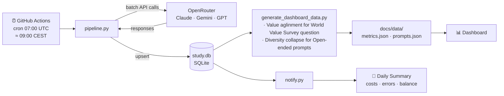

# LLM Dataset Longitudinal Study

Tracks how LLM responses change over time by running the same prompt sets against the latest models of GPT/Claude/Gemini on a recurring daily schedule. Each run is called a **wave** and is stored in `study.db` for longitudinal analysis. A live dashboard is published automatically to GitHub Pages after every run.

---

## Pipeline overview



---

## Datasets

| Dataset | File | Items per wave | Strategy |
|---|---|---|---|
| `global_opinion_qa` | `globalopinionqa_wvs.json` | 352 | Fixed — all WVS questions, every wave |
| `persona_prompts` | `persona_prompts.json` | 429 | Fixed — 143 prompts × 3 conditions: baseline / high\_ses / low\_ses |

Persona prompts are generated by `build_persona_prompts.py` from two query sets:
- **advertising** (50 queries) — consumer/lifestyle topics extracted from [Soumalias et al. (2024)](https://arxiv.org/abs/2405.05905)
- **infinity_chat** (93 queries) — open-ended, philosophical, creative, and practical prompts from [Jiang et al. (2025)](https://arxiv.org/abs/2510.22954) via their [Infinity-Chat collection](https://huggingface.co/collections/liweijiang/artificial-hivemind-6826e108da3260c02a1a2ec0)

Each query produces three items: `baseline` (no persona), `high_ses`, and `low_ses`. Both conditions are framed via **system message** (advertising) or **inline in the user prompt** (infinity\_chat), giving four framing variants per query. The SES persona details are drawn from [Wu et al. (2026)](https://arxiv.org/abs/2604.08525).

## Models

Configured in `config.yaml`. Main models are called via [OpenRouter](https://openrouter.ai):

- **GPT Chat** (`openai/gpt-chat-latest` — resolves to the current GPT chat release)
- **Claude Sonnet** (`~anthropic/claude-sonnet-latest` - redirects to the latest model in the Anthropic Claude Sonnet family)
- **Gemini Pro** (`~google/gemini-pro-latest` - redirects to the latest model in the Google Gemini Pro family)
- **Gemini Flash** (`~google/gemini-flash-latest` - redirects to the latest model in the Google Gemini Flash family)


---

## Running a wave

```bash
# Run today's wave (main models)
python pipeline.py run

# Run with experiment model (google/gemini-2.5-flash-lite)
python pipeline.py run --experiment

# Run a second wave on the same day (avoids name collision)
python pipeline.py run --wave-tag t02

# Override temperature for all models
python pipeline.py run --temperature 1.0
```

Runs are idempotent — if a wave already exists for today, only missing (item × model) pairs are sent. Safe to re-run after a partial failure.

---

## Scheduling

The workflow at `.github/workflows/daily_run.yml` runs automatically every day at **07:00 UTC (≈ 09:00 CEST / 08:00 CET)**. 

Each run:
1. Executes `pipeline.py run` — queries all models, saves responses to `study.db`
2. Executes `generate_dashboard_data.py` — recomputes metrics, writes `docs/data/`
3. Commits `study.db`, `results/`, and `docs/` back to the repository
4. Sends a summary email via `notify.py` 


### Required repository secrets

| Secret | Description |
|---|---|
| `GH_PAT` | Personal Access Token with repo write access (for committing results back) |
| `OPENROUTER_API_KEY` | OpenRouter API key |
| `SMTP_HOST` | SMTP server (e.g. `smtp.gmail.com`) |
| `SMTP_PORT` | SMTP port (e.g. `587`) |
| `SMTP_USER` | Sender email address |
| `SMTP_PASSWORD` | Gmail app password (16 chars, no spaces) |
| `NOTIFY_EMAIL` | Recipient email address |

---

## Dashboard

A static dashboard is auto-published to **GitHub Pages** from the `docs/` folder after every daily run.

| Tab | Sub-Tab | Content |
|---|---|---|
| Overview | **Prompts** | Searchable tables — WVS questions with global distributions; persona prompts with baseline / high SES / low SES side-by-side |
| Analysis | **Model Versions** | Exact model version strings and call counts per wave |
| Analysis | **Value Alignment** | Wasserstein distance and Shannon entropy vs the WVS global distribution, per model per wave |
| Analysis | **Prompt Lengths** | Character-count distributions per condition × framing (baseline / high SES system msg / high SES inline / low SES …) |
| Analysis | **Output Diversity** | Day-over-day cosine similarity of baseline responses (MiniLM-L6-v2) — measures response drift |
| Analysis | **Steering Sensitivity** | Cosine similarity to baseline by framing × SES level per wave — measures how much the persona framing shifts responses |

Cosine charts are computed incrementally by `generate_dashboard_data.py`: only the new wave's responses are embedded on each run (~3 min), with prior results read from the existing JSON. Both cosine tabs remain empty until at least two waves exist.

To regenerate the dashboard data locally after a manual run:

```bash
python generate_dashboard_data.py
```

---

## Daily email

`notify.py` sends an HTML summary email after each run. It includes:
- Per-model OK / error counts and cost
- OpenRouter credit balance (with a warning below $30)
- GitHub repo size and Actions usage

```bash
python notify.py             # send email for today
python notify.py --dry-run   # print report to terminal
python notify.py --date 2026-05-30
```

---

## Exporting results

```bash
python pipeline.py export --format csv     # → results/responses.csv
python pipeline.py export --format json
python pipeline.py export --format jsonl
python pipeline.py export --format parquet
python pipeline.py export --out my_dir/
```

```bash
python export_prompts.py                          # → results/prompts_overview.xlsx
python export_prompts.py --out results/my_out.xlsx
```

```bash
python pipeline.py report    # terminal summary
```

---

## Database schema

`study.db` is a SQLite file with WAL mode. Five tables:

| Table | Purpose |
|---|---|
| `dataset_items` | All unique prompts loaded from datasets |
| `study_waves` | One row per wave (named by date) |
| `model_configs` | LLM endpoints and parameters |
| `wave_items` | Which items were selected for each wave |
| `response_records` | Every (wave × item × model) response |

---

## Repository layout

```
pipeline.py                  # CLI entry point
runner.py                    # Async batch runner (concurrency + rate limiting)
client.py                    # LLM API client (OpenRouter)
db.py                        # SQLite persistence layer
loaders.py                   # Dataset loaders (local JSON, HuggingFace)
analysis.py                  # Export and reporting utilities
notify.py                    # Daily email summary
build_persona_prompts.py     # Regenerates persona_prompts.json from query lists
export_prompts.py            # Exports prompt sets to Excel
generate_dashboard_data.py   # Computes metrics and exports docs/data/ for the dashboard
config.yaml                  # Models, datasets, and pipeline configuration
globalopinionqa_wvs.json     # 352 WVS questions with global distributions
persona_prompts.json         # 429 persona prompt items (143 queries × 3 conditions)
study.db                     # Accumulated response data (all waves)
results/                     # Per-wave exports and Excel overviews
docs/
  index.html                 # GitHub Pages dashboard (static, no build step)
  data/
    metrics.json             # Per-wave computed metrics (WVS, cosine, lengths)
    prompts.json             # Static prompt data (WVS + persona)
.github/workflows/
  daily_run.yml              # GitHub Actions: run → export dashboard → commit → notify
```
